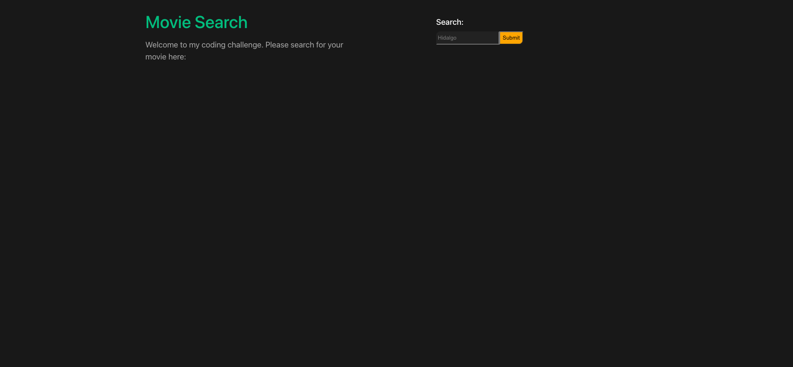

# Code Challenge: Movie App

## Description

This is a coding challenge to build a movie search app in a 4 hour-limit.

## Future direction

I would like to get the api call working so that I can format the page similar to a social media page with cards about each movie. I would also like to add some storage use to keep searches saved for the user that may frequent certain titles.

Items that I had

## Table of Contents

- [Code Challenge: Movie App](#code-challenge-movie-app)
  - [Description](#description)
  - [Future direction](#future-direction)
  - [Table of Contents](#table-of-contents)
  - [Installation](#installation)
  - [Usage](#usage)
  - [Credits](#credits)
  - [License](#license)
  - [How to Contribute](#how-to-contribute)
  - [Tests](#tests)
  - [Questions](#questions)

## Installation

Front end: open the ternminal for the webapp/movieapp folder and run "npm i" then "npm run dev" to see the webpage.
Back end: open the ternminal for the webservice folder and run "npm i" then "npm start".

## Usage

Search for your favorite movies by title to receive some fun facts.

## Credits

Movie info: https://www.themoviedb.org/
Vue: https://vuejs.org/
Node: https://nodejs.org/
Express: https://expressjs.com/
Nuxt: https://nuxtjs.org/

## License

This project is under the .

## How to Contribute

GitHub

## Tests

None yet.

## Questions

Reach me through my GitHub-rtcottle here: https://github.com/rtcottle
